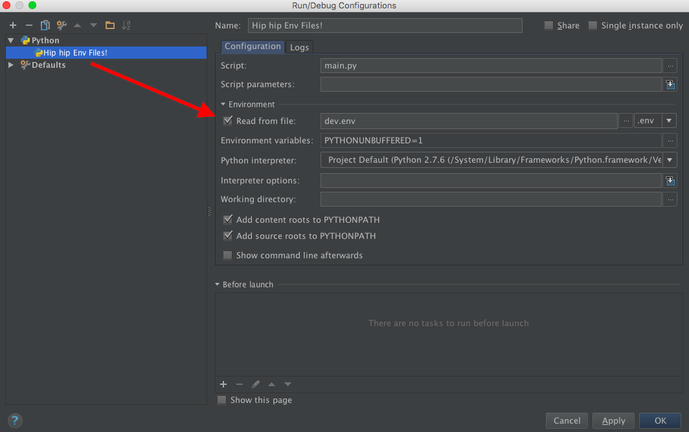

# Introduction

**Env File** is a plugin for PyCharm that allows you to set environment variables from files for Python-based run 
configurations.  *Works with all Python-based run configuration in PyCharm.*

Supported formats:

- **.env**
- **YAML** dictionary
- **JSON** dictionary *(parsed with YAML parser since [JSON is subset of YAML][json-is-yaml])*

**All formats assume that both keys and values are strings.**

# Installation

- Using IDE built-in plugin system:
  - <kbd>Preferences</kbd> > <kbd>Plugins</kbd> > <kbd>Browse repositories...</kbd> > <kbd>Search for "Env File"</kbd> 
  > <kbd>Install Plugin</kbd>
  
- Manually:
  - Download the [latest release][latest-release] and install it manually using <kbd>Preferences</kbd> > 
  <kbd>Plugins</kbd> > <kbd>Install plugin from disk...</kbd>
  
Restart PyCharm.

# Usage

- Add new *Run/Debug configuration*: <kbd>+</kbd> <kbd>Add new configuration</kbd> > <kbd>Python</kbd>
- Enable <kbd>Read from file</kbd> checkbox, select a file and the file format



## Examples

### .env

```ini
# This line is ignored since it's a comment
SECRET_KEY=hip-hip-env-files
VERSION=1.0
```

or 

```ini
# This line is ignored since it's a comment
SECRET_KEY hip-hip-env-files
VERSION 1.0
```

### JSON

```yaml
{
    # JSON doesn't have comments but since JSON is subset of YAML
    # We parse it with YAML parser and therefore have comments
    # And even trialling commas in objects :)
    "SECRET_KEY": "hip-hip-env-files",
    "VERSION": "1.0", # All non-string literals should be enclosed in quotes; btw this is ignored too
}
```
    
### YAML

```yaml
# This line is ignored since it's a comment
SECRET_KEY: hip-hip-env-files
VERSION: "1.0" # All non-string literals should be enclosed in quotes; btw this is ignored too 
```

# Extending Functionality

PyCharm is based on the IDEA core and has awesome extensions engine. **Env File** plugin utilizes it for its own 
purposes and designed to be highly extensible.

If you want to extend it's functionality take a look at [plugin.xml](./META-INF/plugin.xml). 

**Env File** defines two extension points that it uses by itself and that can be used by others:

```xml
<extensionPoints>
    <extensionPoint name="envfileParser" beanClass="net.ashald.envfile.parsers.EnvFileParserExtension">
        <with attribute="implementationClass" implements="net.ashald.envfile.parsers.EnvFileParser"/>
    </extensionPoint>
    <extensionPoint name="envfileFormat" beanClass="net.ashald.envfile.formats.EnvFileFormatExtension"/>
</extensionPoints>
```

**Env File**'s own configuration is a good example of how it can be extended:

```xml
<extensions defaultExtensionNs="net.ashald.envfile">
    <envfileParser id="env" implementationClass="net.ashald.envfile.parsers.DotEnvFileParser"/>
    <envfileParser id="yaml" implementationClass="net.ashald.envfile.parsers.YamlFileParser"/>
    
    <envfileFormat fileExtension="env" parserId="env"/>
    <envfileFormat fileExtension="json" parserId="yaml"/>
    <envfileFormat fileExtension="yaml" parserId="yaml"/>
</extensions>
```

# Further Development

- Add environment variables expansion
- Add support for other JetBrains IDEs (upon requests)
- Add unit tests

# Feedback

Any feedback, bug reports and feature requests are highly appreciated!

Feel free to create an issue, contact me using `Github` or just drop me an email to the address specified in 
[plugin.xml](./META-INF/plugin.xml)`/idea-plugin/vendor@email`. 

# Contributing

If you willing to contribute to the project follow the steps bellow:

- Fork the repo (for details check out the [guide][fork-guide])
- Create a feature/bugfix brunch from the `develop` branch
- Clone the fork to your machine
- Install Gradle
- Navigate into the local copy and execute `gradle setup`
- Open the dir with IntelliJ IDEA
- [Configure IntelliJ IDEA Plugin SDK][idea-sdk-configuration]
- Set *Java Compiler* to **1.6**: go to <kbd>Settings</kbd> > <kbd>Build, Execution, Deployment</kbd> > 
<kbd>Compiler</kbd> > <kbd>Java Compiler</kbd> and set *Project bytecode version* to **1.6**
- Rebuild the project: <kbd>Build</kbd> > <kbd>Rebuild Project</kbd> 
- Add new *Run/Debug configuration*: <kbd>+</kbd> <kbd>Add new configuration</kbd> > <kbd>Plugin</kbd> 
- Run the project and check that Env File plugin is enabled in child PyCharm instance
- Do your changes
- Add yourself to *AUTHORS.md*
- Commit & Push
- Check that you up to date with the *upstream*
- Do interactive rebase and ensure that your commits history is properly organized and has reasonable commit messages
- Create a *Pull Request* into the `develop` branch of this repo

# License

Copyright (c) 2015 Borys Pierov. See the [LICENSE](./LICENSE) file for license rights and limitations (MIT).

[json-is-yaml]:           https://en.wikipedia.org/wiki/YAML#JSON
[latest-release]:         https://github.com/Ashald/EnvFile/releases/latest
[fork-guide]:             https://help.github.com/articles/fork-a-repo/
[idea-sdk-configuration]: http://confluence.jetbrains.com/display/IntelliJIDEA/Prerequisites
